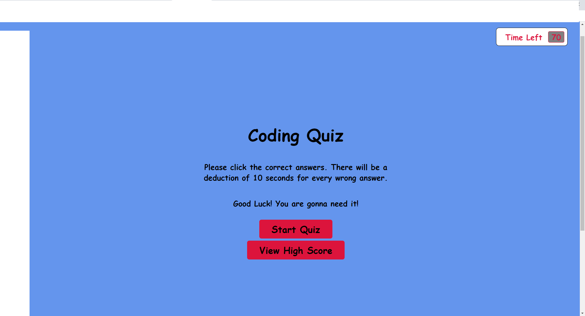

# code quiz-challenge

Javascript Challenge

**Version 1.3.0**

**Code Quiz App challenge activity.**

The aim of this project is to create a fun quiz application that users can play and challenge themselves.

This project focuses on the use of javascript to create this application.

Other than creating a fun app, this project required the use of certain technologies. Using these technologies also ensured that the user has an enjoyable experience, as well as showcases my skills and knowledge gained through this program.

## About the Project 

As I proceed in my career as a web developer, I will probably be asked to complete a coding assessment. These assessments are typically a combination of multiple-choice questions and interactive challenges. As a bootcamp student, I want to build a code quiz application with multiple-choice questions on JavaScript that stores high scores so I can gauge my progress compared my peers.

Initial design of the app has the following deliverables:

The user arrives at the landing page and is presented with a call-to-action to "Start Quiz." Also navigation options to "View Highscores" and the "Time" value set at 0.

Clicking the "Start Quiz" button presents the user with a series of questions. The timer is initialized with a value and immediately begins countdown.

Score is calculated by time remaining. Answering quickly and correctly results in a higher score. Answering incorrectly results in a time penalty (for example, 15 seconds are subtracted from time remaining).

When time runs out and/or all questions are answered, the user is presented with their final score and asked to enter their initials. Their final score and initials are then stored in localStorage.

It is also responsive and designed with mobile first principle.

## Minimun Requirements

Functional, deployed application.

GitHub repository with README describing project.

The first view of the application displays a button that starts the quiz.

Clicking the start button displays a series of questions.

Once the quiz begins, a timer starts.

If a question is answered incorrectly, additional time is subtracted from the timer.

The timer stops when all questions have been answered or the timer reaches 0.

After the game ends, the user can save their initials and score to a highscores view using local storage.

## Built With

- HTML
- CSS
- Javascript

## Work Completed

**A successful completion of this project includes the following:**

- [x]Pseudo coding
- [x]Use of loops and if, else, esleif, and while statements.
- [x]Application of arrays
- [x]Use of DOM and other methods
- [x]Creating multiple variables and functions
- [x]Applying queryselectors to retrieve information

## Project Visual

- [x]Showing the originial state of the app

## Github pages and links

This project has been deployed to GitHub Pages. 
- [Deployed application](https://kenesei91.github.io/quiz-challenge/){:target="_blank" "rel="moopener"}

- [Github Repository](https://github.com/kenesei91/quiz-challenge){:target="_blank" "rel="moopener"}

## Contributors

- Kenechukwu K Ilochonwu <keneilo91@yahoo.com>

## Licence & Copyright

© Kenechukwu K Ilochonwu, Web Project Design

Licensed under the [LICENSE] (MIT LICENSE)